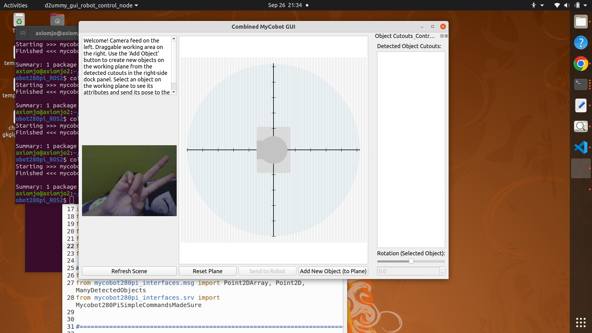
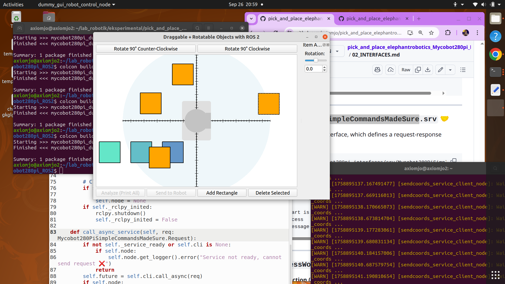
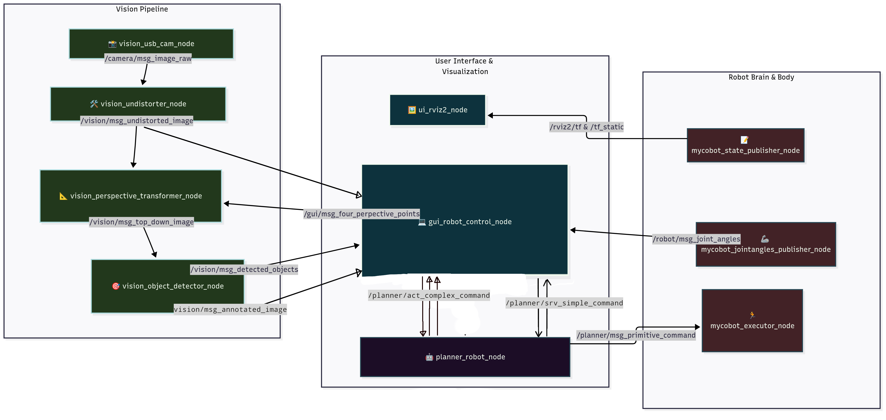

[LAST EDITED: 26 SEP 2025 17:21]

basically alu mundur ke gui 3 sept.



---
basically aku mundur ke branch MVP_3_4_5 krn guinya broken.




----
# Implementasi_MyCobot280pi_ROS2

branch `FINAL_VERSION`
this branch will be the one with clear patterns and naming conventions.    

# === SYSTEM OVERVIEW ===


Sistem robot + antarmuka visual untuk mempermudah pengoperasian Mycobot 280 pi, dalam menjalankan tugas vacuum-and-place.
Dilengkapi computer vision, sehingga bisa ngerti konteks objek di lingkungannya.

--- 

dibuat untuk Tugas Akhir  
Josephine Dermawan   
Institut Sains dan Teknologi Terpadu Surabaya  
2025  

yg berjudul :  
"Implementasi Lengan Robot MyCobot 280 Pi untuk Memindahkan Koleksi Tanaman Kering di antara Lembaran Buku"

# === Author's Note ===
Hi buat siapapun yg baca repo ini.  

tbh, aku ga berencana lanjutin proyek ini klo dah lulus.
tapi semoga repo ini bisa jadi pintu masuk buat anak2 elektro (atau infor) di ISTTS
yg mo nyentuh ROS2 .

Selama development, aku pake:  
- Linux Ubuntu 20.04 *  
- ROS2 Galactic Geochelone *  
- pymycobot 3.4.7 **  
- OpenCV (opencv-contrib-python 4.12.0.88)  

* Linux sana ROS2 nya kudu sepasang, krn tiap distro ROS2 punya distro linux yg direkomendasiin. why? i dunno, its what their devs said. 
* aku kekeuh pake ini krn tahun 2025, elephantrobotics blom ngeluarin image buat upgrade rasppi robotnya, jadi stuck sama ubuntu 20.04 :[ . kyknya merek lebih pingin ngelanjutin mycobot yg jetson nano daripada pi. mboh ya.
** pymycobot ada versi terbaru, tapi krn aku gaberani ngutak-ngatik sistem robotnya, aku putusin laptopnya ngikut robotnya.
*** kampus punya lengan robot, ada 2. di jurusan teknik industri.

mungkin ini bakal jadi repo mati.  
tapi moga ada manfaatnya dikit lah.  

klo mau liat buku TA ku, bisa diakses di github repo yg ini (klo udh kubikin public LOL):
https://github.com/axiomjo/konten_TA# 

mulai dari sini ke bawah, bahasanya nyampur2 inggris indo ya. soalnya aku capek mikir.
jadi.... uhmmm... i'll choose whichever is easier for me anyways.
have fun exploring. u'll definitely find little notes here and there.

# === HOW TO RUN THIS SYSTEM ===


```
# TO-DO: LAUNCH FILE.

# SEMENTARA: NODE SATU-SATU.

 ros2 run mycobot280pi_gui gui_robot_control_node
 
 
v4l2-ctl --list-devices


ros2 run usb_cam usb_cam_node_exe --ros-args --remap /image_raw:=/camera/image_raw -p camera_info_url:="file:///home/axiomjo/lab_robotik/eksperimental/ws_ROS2_mycobot280pi/src/CAM_object_detect/my_camera_capture/hardware_specifics/camera_calibration.yaml" -p camera_name:="my_camera" -p video_device:="/dev/video3"

ros2 run mycobot280pi_vision vision_undistorter_node --ros-args -p camera_info_file:="/home/axiomjo/lab_robotik/eksperimental/ws_ROS2_mycobot280pi/src/CAM_object_detect/my_camera_capture/hardware_specifics/camera_calibration.yaml"


ros2 run mycobot280pi_vision vision_perspective_transform_node

ros2 run mycobot280pi_vision vision_object_detector_node


ros2 run mycobot280pi_planner planner_robot_node

ros2 run mycobot280pi_robot robot_mycobot_joint_publisher_node

```

---

[PENAMAAN INI UDH FIX, GA GANTI2 LAGI.]
# ==== NODE COMMUNICATION =======

### **1. `vision_usb_cam_node`** Node 📸  (ROS2 PRE-BUILT PKG)

**"Ciri Khas":** The Streamer.  
**Function:** Captures raw, barrel-distorted images from the webcam using the ROS2's preexisting `usb_cam` package. It's the main image source for the pipeline. serius ini gunanya cuma ngasih image stream aja wkwkwkwkwk.  
**Expected Task:** Continuously stream raw images from the webcam.  

#### Node Parameter Configuration

1. `video_device` Parameter
   * **Interface Type:** `String`
   * **Details:** This is a mandatory parameter that specifies the path to your USB camera device. A common value is /dev/video0
  
2. `camera_name` Parameter
   * **Interface Type:** `String`
   * **Details:** This parameter sets the name of the camera, which is used to define its frame ID in the ROS TF tree.
      

```

THIS WAS MY SUCCESFULL ATEMPT. BLOM SESUAI SAMA DESAIN TERBARU

   --ros-args -p camera_info_url:="file:///home/axiomjo/lab_robotik/eksperimental/ws_ROS2_mycobot280pi/src/CAM_object_detect/my_camera_capture/hardware_specifics/camera_calibration.yaml" -p camera_name:="my_camera" -p video_device:="/dev/video0"

janlup 

v4l2-ctl --list-devices 

buat tau param -p video_device:="/dev/APAAAAAINII"  kadang sering ganti2 soalnya.


   
```
#### Node Communication Role

##### Publishers

1. `/camera/msg_image_raw` Topic
   * **Interface Type:** `sensor_msgs/msg/Image`
   * **Details:** Publishes to `vision_undistorter_node`.

---

### **2. `vision_undistorter_node`**  Node 🛠️

**"Ciri Khas":** The Barrel Distortion Fixer  
**Function:** Subscribes to the topic `/camera/image_raw`, applies lens correction, and publishes a cleaner, undistorted image stream. btw, dapet data buat ngoreksi distortionnya pake ChArUCo 10x10. trus aku pake python script buat generate .yaml file untuk nyimpen data-data cameranya.  
**Expected Task:** Provide undistorted images for downstream nodes.  

#### Node Parameter Configuration

1. `camera_info_url` Parameter
   * **Interface Type:** `String`
   * **Details:** This parameter should be filled with the absolute path to a YAML file containing the camera's intrinsic calibration data from `camera_calibration.yaml`, which was generated from running the python script `charuco_calibration_file.py` inside `hardware_specifics`directory inside the vision package.  This file is used by the node to correct lens distortion in the image stream.

```
   INI NTAR FILEPATHNYA KUDU DIURUS SM LAUNCHFILES. use FindPackageShare in the Python launch file. SO IT CAN dynamically finds the path to the package at runtime. tapi sementara, absolute dulu y.
   
   --ros-args -p camera_info_file:="/home/axiomjo/lab_robotik/eksperimental/ws_ROS2_mycobot280pi/src/CAM_object_detect/my_camera_capture/hardware_specifics/camera_calibration.yaml"
   
```

#### Node Communication Role

##### Subscribers

1. `/camera/msg_image_raw` Topic
   * **Interface Type:** `sensor_msgs/msg/Image`
   * **Details:** Receives from `vision_usb_cam_node`.
     
##### Publishers

1. `/vision/msg_undistorted_image` Topic
   * **Interface Type:** `sensor_msgs/msg/Image`
   * **Details:** Publishes to `vision_perspective_transformer_node` and `gui_robot_control_node`.

---

### **3. `vision_perspective_transformer_node`** Node 📐

**"Ciri Khas":** The Alligner  
**Function:** Subscribes to image stream`/vision/msg_undistorted_image` from the node before, and also subscribes to `/vision/msg_four_perspective_points` that was provided by the GUI.it then performs a perspective transform, and publishes the corrected image at the topic `/vision/msg_top_down_image` . yk, kyk fitur cam scanner yg geser2 titik buat nge-crop dokumen, kyk fitur ibispaint X yg bisa perspective warp sebuah image :D. mereka inspirasiku wkwkwkwk.  
**Expected Task:** Transform the image based on user-selected points and publish the result.  

#### Node Communication Role

##### Subscribers

1. `/vision/msg_undistorted_image` Topic
   * **Interface Type:** `sensor_msgs/msg/Image`
   * **Details:** Receives from `vision_undistorter_node`.

2. `/gui/msg_four_perspective_points` Topic
   * **Interface Type:** `mycobot280pi_interfaces/msg/Point2DArray`
   * **Details:** Receives from `gui_robot_control_node`.
     
##### Publishers

1. `/vision/msg_top_down_image` Topic
   * **Interface Type:** `sensor_msgs/msg/Image`
   * **Details:** Publishes to `vision_object_detector_node` and `gui_robot_control_node`.

---

### **4. `vision_object_detector_node`** Node 🎯

**"Ciri Khas":** The Finder  
**Function:** constantly detects blob in the `/vision/msg_top_down_image` image stream from the node before, runs blob detection algorithm, gets their center points, draw bounding boxes, and publishes detected object data `/vision/detected_objects`  and the image `/vision/msg_annotated_image`  for the GUI.  
**Expected Task:** Detect objects in the corrected image and publish results.  

#### Node Communication Role

##### Subscribers

1. `/vision/msg_top_down_image` Topic
   * **Interface Type:** `sensor_msgs/msg/Image`
   * **Details:** Receives from `vision_perspective_transformer_node`.
     
##### Publishers

1. `/vision/msg_detected_objects` Topic
   * **Interface Type:** `mycobot280pi_interfaces/msg/ManyDetectedObjects`
   * **Details:** Publishes to `gui_robot_control_node`.

2. `/vision/msg_annotated_image` Topic
   * **Interface Type:** `sensor_msgs/msg/Image`
   * **Details:** Publishes to `gui_robot_control_node`.
  
---

### **5. `gui_robot_control_node`** Node 💻

**"Ciri Khas":** The Commander  
**Function:** take a deep breath... this one got a LOT of responsibilities as the gui. basically, it gives the user an easy way to control the visual correction, monitor the robot, and control the robot using simple and complex commands. and coz its so big, this node will be divided up into python modules.   

to control the visual correction, this node displays a smaller version of `/vision/msg_undistorted_image` and then overlaying that image with four draggable connected points. this gui node then publishes the mapped position of those points into an array in `/vision/msg_four_perspective_points`, so that `vision_perspective_transformer_node` can do its transformation. the resulting perspective transformed image`/vision/msg_top_down_image` is displayed in the gui. thus, users can keep adjusting the fours points until the whole 300mmx300mm workspace area is detected. 

btw, how does the system provide the objects that user can interact with in the workspace? well, the detected object information `/vision/msg_detected_objects` is used as the anchor to crop object images in the bounding box `/vision/msg_annotated_image` ! theen, through a series of geometric mathematical calculation to finally know where to put these cutouts in the user's workspace, u can see a simplified but correct-ish representation of the real world from top down view! fyi, from this project, i just learned that computer graphics coordinate system ISN'T EXACTLY THE SAME as a typical cartesian coordinate system... it's y axis is flipped... AND THE CENTER POINT of computer graphics coordinate system isn't in the center of the screen, its on the top left(?) corner of the screen. like, whyyyyyyy? i spent more than a day trying to give transforms so in the end it can mimic a conventional coordinate system :''''''''''''''''']  

then, to let the user tell the robot what things to move where A.K.A complex command, the gui have a workspace area where users can drag, drop, and edit the orientation of the detected image, before finally calling an action `/planner/process_workspace` ! btw, this part stumped me coz thinking about a gui like this is NOT SMTHG i learned in any of my college classes :\ . i take inspiration from games hahahaha. this gui node then saves a list of "moved objects" and their "before-after" and shove it all to the `planner_robot_node`. good luck planner node, ur the one who has to think hard to complete this action hahahaha. along the progress that the planner node does, the gui will get feedback that will be displayed to the user. this way, u can know how much items left the robot needs to move around.  

to control the robot with simple commands, the gui provides buttons. A LOT OF BUTTONS. from a panel with a button to add a square, which can be used as a visual marker to move the robot to it's center point, and a button to tell the robot to go there, an EMERGENCY button to STOP AND GO TO HOME POSITION if anything bad happens, and even buttons to manually set the vacuum pump. the gui basically trriggers a service call for `/planner/srv_simple_command` so the  `planner_robot_node` can know when user wants to do simple stuff. btw, klo tadi habis nyuruh robotnya complex command, buttons ini semua, kecuali yg EMERGENCY, bakal ke-disable, kecuali kita rela cancel actionnya di tengah jalan...  

if the user want to refresh the scene since they felt that the current worksapce no longer reflect the real-world condition, they can always press the "refresh scene" button, and the gui's memory will be reset-ed into a fresh new clean slate, importing the objects that is detected in `/vision/msg_annotated_image`.   

btw, in the workspace, theres a small portion reserved for book fipping. user can flip the book pages and put items there to place stuff inside the book. honestly, i regret promising this feature in the proposal because it makes MY PROJECT HARDER THAN IT COULD'VE BEEN :c . but i guess it adds a cool memorable feature? idk. semoga ga sia2 mikir buat ini.  

lastly, to see the way this robot joints move in real-time, user can see the displayed `/robot/msg_joint_angles` that is presented in bars. i take inspiration from gazebo11's interface that lets user move the robot's end effector. fyi, mycobot has limits for their joints :[ klo kamu paksa dia muter lebih dari yg dia bisa... shell robotnya bisa retak... kan ga lucu ya... :c partnya bujubuneng mahalnya weh, jgn dah.  

**Rangkuman Tugas:**

* Display image streams & final processed image

* Allow interactive perspective editing

* Allow interactive workspace editing

* Reports the robot's current joint angles from J1 to J6 

* Initiate simple commands

* Initiate robot planner and displays real time report
  
#### Node Communication Role
  
##### Subscribers
1. `/vision/msg_undistorted_image` Topic
   * **Interface Type:** `sensor_msgs/msg/Image`
   * **Details:** Receives from `vision_undistorter_node`.

2. `/vision/msg_detected_objects` Topic
   * **Interface Type:** `mycobot280pi_interfaces/msg/ManyDetectedObjects`
   * **Details:** Receives from `vision_object_detector_node`.

3. `/vision/msg_annotated_image` Topic
   * **Interface Type:** `sensor_msgs/msg/Image`
   * **Details:** Receives from `vision_object_detector_node`.

4. `/robot/msg_joint_angles` Topic
   * **Interface Type:** `sensor_msgs/msg/JointState`
   * **Details:** Receives from `mycobot_jointangles_publisher_node`.

   
##### Publishers

1. `/gui/msg_four_perspective_points` Topic
   * **Interface Type:** `mycobot280pi_interfaces/msg/Point2DArray`
   * **Details:** Publishes to `vision_perspective_transformer_node`.
 
    
##### Service Client

1. `/planner/srv_simple_command` Service
   * **Interface Type:** `mycobot280pi_interfaces/srv/Mycobot280PiSimpleCommandsMadeSure`
   * **Details:** Sends requests to `robot_planner_node`.
   
##### Action Clients

1. `/planner/act_complex_command` Action
   * **Interface Type:** `mycobot280pi_interfaces/action/ProcessWorkspace`
   * **Details:** Sends requests to `robot_planner_node`.

---

### **6. `planner_robot_node`** Node 🤖

**"Ciri Khas":** The Robot Planner
**Function:** Plan and execute a sequence of robot actions. btw, node planner ini kan dapet 2 jenis perintah ya, yg complex sama yg simpel2. klo yg simpel,`/planner/srv_simple_command`, ya cuma dapet trus lakuin. klo yg complex, `/planner/act_complex_command`, ada feedback sepanjang lagi ngerjain. trus, gmn cara dia mikir? well, di dalem node ini, ada switch case yg panjang buat mecah perintah complex ke perintah primitif wkwkwkwkwkwk. trus si planner node ini bakal ngepublish `/planner/msg_primitive_commands` ke `robot_executor_node`. knp ga service? mumet. lebih gampang publish. dan mycobot bisa.

**Expected Task:** Plan and execute the generated sequence of robot commands. 

#### Node Communication Role
  
##### Publisher

1. `/planner/msg_primitive_command` Topic
   * **Interface Type:** `mycobot280pi_interfaces/msg/SimpleCommands`
   * **Details:** Publishes to `mycobot_executor_node`.
     
##### Service Server

1. `/planner/srv_simple_command` Service
   * **Interface Type:** `mycobot280pi_interfaces/srv/Mycobot280PiSimpleCommandsMadeSure`
   * **Details:** Handles service requests from `gui_robot_control_node`.
   
##### Action Server

1. `/planner/act_complex_command` Action
   * **Interface Type:** `mycobot280pi_interfaces/action/ProcessWorkspace`
   * **Details:** Handles action requests and give feedback to `gui_robot_control_node`.

---

### **7. `mycobot_executor_node`** Node🏃

**"Ciri Khas":** The Command Executor inside the actual robot
**Role:** MyCobot pymycobot API Executor
**Function:** Translates commands to ElephantRobotics'  pymycobot API calls in the robot.
**Expected Task:** Perform robot actions as commanded.

#### Node Communication Role

##### Subscribers

1. `/planner/msg_primitive_command` Topic
   * **Interface Type:** `mycobot280pi_interfaces/msg/SimpleCommands`
   * **Details:** Receives from `planner_robot_node`.

---

### **8. `mycobot_jointangles_publisher_node`** Node 🦾

**"Ciri Khas":** The Robot Joint Reporter
**Role:** Publisher
**Function:** calls the getangles() pymycobot API and publishes the each joint angles to `/robot/msg_joint_angles` for GUI visualization and monitoring.
**Expected Task:** Continuously report joint state.

#### Node Communication Role

##### Publishers

1. `/robot/msg_joint_angles` Topic
   * **Interface Type:** `sensor_msgs/msg/JointState`
   * **Details:** Publishes to `gui_robot_control_node`.

---

### **9. `mycobot_state_publisher_node`** Node 📝 (ROS2 PRE-BUILT PKG)

**"Ciri Khas":** The State Broadcaster
**Role:** Publisher
**Function:** Publishes the robot’s internal state for rviz2 visualization using ROS2's preexisting  `robot_state_publisher` package.
**Expected Task: Broadcast robot state for rviz2.

#### Node Parameter Configuration
1. `robot_description` Parameter
   * **Interface Type:** `String`
   * **Details:** This parameter should be filled with  MyCobot290Pi robot's entire model in the Unified Robot Description Format (URDF). This is an example of it in my machine
   
```
I NEED MY LAUNCH FILE TO IMPORT XACRO AND PROCESS IT INSIDE AND THENNN PASS IT AS A LAUNCH FILE PARAM. ya tapi krn aku blom launch files, jadi di terminal gini dulu y.

   XACROED=$(xacro "/home/axiomjo/lab_robotik/eksperimental/ws_ROS2_mycobot280pi/install/mycobot_description/share/mycobot_description/urdf/mycobot_280_pi/mycobot_280_pi_with_pump.urdf" )

ros2 run robot_state_publisher robot_state_publisher --ros-args -p robot_description:="${XACROED}"
```
#### Node Communication Role

##### Publishers

1. `/rviz2/tf_static` Topic
   * **Interface Type:** `tf2_msgs/msg/TFMessage`
   * **Details:** Publishes the static transforms for the robot. These are the fixed relationships between a robot's links and are defined by the URDF.  Publishes to `ui_rviz2_node`.
   
2. `/rviz2/tf` Topic
   * **Interface Type:** `tf2_msgs/msg/TFMessage`
   * **Details:** This topic publishes the dynamic transforms of the robot, which are the transforms that change based on the joint states. Publishes to `ui_rviz2_node`.

 
---


### **10. `ui_rviz2_node`** Node 🖼️ (ROS2 PRE-BUILT PKG)

**"Ciri Khas":** The Extra Visualizer
**Role:** Visualization Tool
**Function:** Subscribes to a variety of topics to display a complete 3D visualization of the robot using the ROS2's preexisting `rviz2` package
**Expected Task:** Display robot and scene data for monitoring.

#### Node Communication Role

##### Subscribers

1. `/rviz2/tf_static` Topic
   * **Interface Type:** `tf2_msgs/msg/TFMessage`
   * **Details:** Receives the static transforms for the robot. These are the fixed relationships between a robot's links and are defined by the URDF. Receives from `mycobot_state_publisher_node`. 
     
2. `/rviz2/tf` Topic
   * **Interface Type:** `tf2_msgs/msg/TFMessage`
   * **Details:** Receives from `mycobot_state_publisher_node`.


---


# =========================================== 18 ept DESKRIPSI NODE UDH WARAS. BARU SAMPE SINI================================
# ===== INTERFACES FOR MESSAGES, SERVICES, ACTIONS ====

[last editede: 6 Sep 2025 16:48]

`/camera` Namespace
This namespace is used for raw image data from the camera.

1. **`/camera/image_raw`**
   
        **Interface Type:** `sensor_msgs/msg/Image`
               **Publisher:** `vision_usb_cam_node`📸
           **Subscriber:** `vision_undistorter_node`🛠️

---

### `/vision` Namespace

This namespace is for all the processed image and object detection data.

1. **`/vision/undistorted_image`**
           **Interface Type:** `sensor_msgs/msg/Image`
           **Publisher:** `vision_undistorter_node`🛠️
           **Subscriber:** `vision_perspective_transformer_node`, 📐`gui_robot_control_node`💻
2. **`/vision/corrected_image`**
           **Interface Type:** `sensor_msgs/msg/Image`
           **Publisher:** `vision_perspective_transformer_node`📐
           **Subscriber:** `vision_object_detector_node`🎯, `gui_robot_control_node`💻
3. **`/vision/perspective_points`**
           **Interface Type:** `mycobot280pi_interfaces/msg/Point2DArray`
           **Publisher:** `gui_robot_control_node`💻
           **Subscriber:** `vision_perspective_transformer_node`📐
4. **`/vision/detected_objects`**
           **Interface Type:** `mycobot280pi_interfaces/msg/ManyDetectedObjects`
           **Publisher:** `vision_object_detector_node`🎯
           **Subscriber:** `planner_robot_node`🤖, `gui_robot_control_node`💻

---

### `/robot` Namespace

This namespace contains topics related to the physical robot's state and general commands.


1. **`/robot/joint_states`**
           **Interface Type:** `sensor_msgs/msg/JointState`
           **Publisher:** `robot_mycobot_joint_publisher_node`🦾
           **Subscriber:** `gui_robot_control_node`💻
           
---

### `/planner` Namespace

This namespace is used for all communication with the robot's planning node.

1. **`/planner/commands`** (Topic)
           **Interface Type:** `mycobot280pi_interfaces/msg/SimpleCommands`
           **Publisher:** `planner_robot_node`🤖
           **Subscriber:** `robot_mycobot_executor_node`🏃
2. **`/planner/set_coords`** (Service)
           **Interface Type:** `mycobot280pi_interfaces/srv/Mycobot280PiSetCoordsMadeSure`
           **Client:** `gui_robot_control_node`💻
           **Server:** `planner_robot_node`🤖
3. **`/planner/process_workspace`** (Action)
           **Interface Type:** `mycobot280pi_interfaces/action/ProcessWorkspace`        
           **Client:** `gui_robot_control_node`💻
           **Server:** `planner_robot_node`🤖
4. **`/planner/manual_commands`**
           **Interface Type:** `mycobot280pi_interfaces/msg/SimpleCommands`
           **Publisher:** `gui_robot_control_node`💻
           **Subscriber:** `planner_robot_node`🤖

---

### `/rviz2` Namespace

This namespace is used for all the extra 3d visualization using rviz2.

1. **`/rviz2/tf_static`** (Topic)
            **Interface Type:** `tf2_msgs/msg/TFMessage`
            **Publisher:** `mycobot_state_publisher_node`📝
            **Subscriber:** `ui_rviz2_node`🖼️

2. **`/rviz2/tf`** (Topic)
            **Interface Type:** `tf2_msgs/msg/TFMessage`
            **Publisher:** `mycobot_state_publisher_node`📝
            **Subscriber:** `ui_rviz2_node`🖼️


# ===== PACKAGEs TO BE BUILT =======

### 1. `mycobot280pi_interfaces` Package Overview  📦

 This package contains no nodes. It holds the custom message, service, and action definitions that all the other packages will use for communication.

--- 

### 2. `mycobot280pi_vision` Package Overview 🛠️ 📐 🎯

This package is for the entire vision pipeline. All nodes related to image capture, processing, and object detection belong here.

1. **`vision_undistorter_node`** - The Barrel Distortion Fixer
2. **`vision_perspective_transformer_node`** - The Perspective Aligner
3. **`vision_object_detector_node`** - The Finder

---

### 3. `mycobot280pi_robot` Package Overview 🦾📝🏃

This package contains the core robot control and state-reporting nodes that communicate directly with MyCobot 280 Pi or the ROS 2 ecosystem. It needs to be run on the MyCobot 280 Pi.

1. **`robot_mycobot_joint_publisher_node`** - The Robot Joint Reporter
2. **`robot_mycobot_executor_node`** - The Command Executor

---

### 4.`mycobot280pi_planner` Package Overview 🤖

This package holds the high-level logic for autonomous operation, including planning and command dispatch.

1. **`planner_robot_node`** - The Robot Planner

---

### 5.`mycobot280pi_gui` Package Overview 💻

This is the dedicated package for your user interface.

1. **`gui_robot_control_node`** - The Commander

---

### 6. Pre-Existing ROS 2 Tool Packages 📸 🖼️

1. **`vision_usb_cam_node`** - The Raw Image Publisher from `usb_cam`
2. **`ui_rviz2_node`** - The Extra Visualizer from `rviz`
3. **`mycobot_state_publisher_node`** - The State Broadcaster from `robot_state_publisher` 

--- 

# ===== NODE DEPENDENCIES AND PARTS ======

[last edited 6 Sep 2025 15:22]

### `vision_undistorter_node` Node Breakdown 🛠️

- **Predicted Complexity:** Short

- **Possible Dependencies:** `rclpy`, `sensor_msgs/msg/Image`, `cv_bridge`, `OpenCV`

- **Separation of Concerns:**
  
  - `mycobot280pi_vision/vun_main_ros_node.py` (The main ROS node file)

---

### `vision_perspective_transformer_node` Node Breakdown 📐

- **Predicted Complexity:** Medium

- **Possible Dependencies:** `rclpy`, `sensor_msgs/msg/Image`, `mycobot280pi_interfaces/msg/Point2DArray`, `cv_bridge`, `OpenCV`

- **Separation of Concerns:**
  
  1. `mycobot280pi_vision/vptn_main_ros_node.py`(The main ROS node file)
  
  2. `mycobot280pi_vision/vptn_perspective_transform.py`(The module with the core OpenCV transformation algorithm)

---

### `vision_object_detector_node` Node Breakdown 🎯

- **Predicted Complexity:** Long

- Possible Dependencies:** `rclpy`, `sensor_msgs/msg/Image`, `mycobot280pi_interfaces/msg/ManyDetectedObjects`, `cv_bridge`, `OpenCV`

- **Separation of Concerns:**
  
  1. `mycobot280pi_vision/vodn_main_ros_node.py`(The main ROS node file)
  
  2. `mycobot280pi_vision/vodn_object_detection.py`(The module with the vision algorithm)
  
  3. `mycobot280pi_vision/vodn_message_converter.py` (The module to convert data types to ROS messages)

---

### `gui_robot_control_node` Node Breakdown 💻

- **Predicted Complexity:** Very Long

- **Possible Dependencies:** `rclpy`, `mycobot280pi_interfaces`, `sensor_msgs`, `PyQt5`

- **Separation of Concerns:**
  
  1. `grcn_main.py` (The main entry point). 
  
  2. `grcn_gui_main_window.py` (The main GUI window and layout). 
  
  3. `grcn_gui_camera_panel.py` (The camera feed panel). 
  
  4. `grcn_gui_working_plane.py` (The working plane visualization).
  
  5. `grcn_gui_dock_panel.py` (The object cutout and rotation panel).
  
  6. `grcn_gui_control_panel.py` (The button and control panel).
  
  7. `grcn_pyqt_widget.py` (Custom PyQt widgets).
  
  8. `grcn_ros_communication.py` (The ROS communication class). 
---

### `planner_robot_node` Node Breakdown 🤖

- **Predicted Complexity:** Very Long

- **Possible Dependencies:** `rclpy`, `mycobot280pi_interfaces`, `sensor_msgs`

- **Separation of Concerns:**
  
  1. `mycobot280pi_planner/rpn_main_ros_node.py`(The main ROS node file)
  
  2. `mycobot280pi_planner/rpn_planning_logic.py`(The core Finite-State-Machine implementation for planning and decision-making logic)
  
  3. `mycobot280pi_planner/rpn_action_server.py`(A class to handle the action server)
  
  4. `mycobot280pi_planner/rpn_service_server.py`(A class to handle the service server)

---

### `robot_mycobot_joint_publisher_node` Node Breakdown 🦾

- **Predicted Complexity:** Short

- **Possible Dependencies:** `rclpy`, `pymycobot`, `sensor_msgs/msg/JointState`

- **Separation of Concerns:**
  
  - `mycobot280pi_robot/rmjpn_main_ros_node.py` (The main ROS node file that performs a simple API read and publishes a single topic)

---

### `robot_mycobot_executor_node` Node Breakdown 🏃

- **Predicted Complexity:** Long

- **Possible Dependencies:** `rclpy`, `mycobot280pi_interfaces`, `pymycobot`

- **Separation of Concerns:**
  
  1. `mycobot280pi_robot/rmen_main_ros_node.py`(The main ROS node file)
  
  2. `mycobot280pi_robot/rmen_mycobot_interface.py`(A module that encapsulates the pymycobot API calls)
  
  3. `mycobot280pi_robot/rmen_robot_state_manager.py`(A module for handling the robot's current FSM state and errors)

---

# ===== PACKAGE DEPENDENCIES =======

[last edit: 6 Sep 2025 17:29]

### 1. `mycobot280pi_interfaces` Package Dependencies 📦

This package contains no nodes. It holds the custom message, service, and action definitions that all the other packages will use for communication.

From `src` directory:

#### Package Creation + Dependencies Flag

```bash
ros2 pkg create mycobot280pi_interfaces --build-type ament_cmake --dependencies std_msgs action_msgs
```

##### Standard ROS 2 Interfaces Dependencies

- `std_msgs`:  builtin interface
  
  - **`std_msgs/Header`**: for`ManyDetectedObjects.msg` timestamps and frame information.

- `action_msgs`: 
  
  - **`std_msgs/Header`** for `ProcessWorkspace.action` ROS 2 action system
  
  ---

### 2. `mycobot280pi_vision` Package Dependencies 🛠️ 📐 🎯

This package is for the entire vision pipeline. All nodes related to image capture, processing, and object detection belong here.

#### Package Creation + Dependencies Flag

From `src` directory:

```bash
ros2 pkg create mycobot280pi_vision --build-type ament_python --dependencies rclpy sensor_msgs mycobot280pi_interfaces cv_bridge
```

##### Core ROS 2 Dependencies

These are fundamental to any ROS 2 Python node.

1. `rclpy`: The core client library for Python.

##### Standard ROS2 Tools Dependencies

These are standard packages from the ROS 2 ecosystem for common data types and functionalities.

1. `cv_bridge` : The package to interface with OpenCV.  

##### Standard ROS2 Interfaces Dependencies

1. `sensor_msgs`: builtin interface
   
   - **`sensor_msgs/msg/Image`**: To subscribe to raw images from the camera  

##### Custom Interfaces Dependencies

1. `mycobot280pi_interfaces`: custom interface
   
   - **`mycobot280pi_interfaces/msg/Point2DArray`**: To receive perspective points from the GUI
   - **`mycobot280pi_interfaces/msg/ManyDetectedObjects`**: To publish the results of the object detection    

##### Third-Party Libraries Dependencies

This is an external library that provides the core algorithms for your vision nodes.

1. `OpenCV`: need to install this separately: `pip install opencv-contrib-python`

---

### 3. `mycobot280pi_robot` Package Dependencies 🦾📝🏃

This package contains the core robot control and state-reporting nodes that communicate directly with MyCobot 280 Pi or the ROS 2 ecosystem. It needs to be run on the MyCobot 280 Pi.

#### Package Creation + Dependencies Flag

From `src` directory:

```bash
ros2 pkg create mycobot280pi_robot --build-type ament_python --dependencies rclpy sensor_msgs tf2_ros tf2_msgs mycobot280pi_interfaces
```

##### Core ROS2 Dependencies

These are fundamental to any ROS 2 Python node.

1. `rclpy`: The core client library for Python.

##### Standard ROS2 Interfaces Dependencies

1. `sensor_msgs`: builtin interface
   
   - **`sensor_msgs/msg/JointState`**: To publish the robot's joint states for monitoring (`robot_mycobot_joint_publisher_node`).

2. `tf2_msgs`: builtin interface
   
   - **`tf2_msgs/msg/TFMessage`**: To broadcast the robot's state transforms (`mycobot_state_publisher_node`).

##### Custom Interfaces Dependencies

1. `mycobot280pi_interfaces`: custom interface
   
   - **`mycobot280pi_interfaces/msg/SimpleCommands`**: To receive commands from the planner and GUI (`robot_mycobot_executor_node`).

##### Third-Party Libraries Dependencies

1. `pymycobot`: The Python API used to interface with the MyCobot robot hardware.

---

### 4.`mycobot280pi_planner` Package Dependencies 🤖

This package holds the high-level logic for autonomous operation, including planning and command dispatch.

From `src` directory:

```bash
ros2 pkg create mycobot280pi_planner --build-type ament_python --dependencies rclpy mycobot280pi_interfaces sensor_msgs action_msgs
```

##### Core ROS2 Dependencies

These are fundamental to any ROS 2 Python node.

1. `rclpy`: The core client library for Python.

##### Custom Interfaces Dependencies

1. `mycobot280pi_interfaces`: custom interface
   
   - **`mycobot280pi_interfaces/msg/ManyDetectedObjects`**: To receive detected object data from the vision pipeline 
   - **`mycobot280pi_interfaces/msg/SimpleCommands`**: To send high-level commands to the robot executor node 
   - **`mycobot280pi_interfaces/srv/Mycobot280PiSetCoordsMadeSure`**: To receive requests for manual coordinate control from the GUI 
   - **`mycobot280pi_interfaces/action/ProcessWorkspace`**: To receive requests from the GUI to process the entire workspace

---

### 5.`mycobot280pi_gui` Package Dependencies 💻

This is the dedicated package for your user interface.

From `src` directory:

```bash
ros2 pkg create mycobot280pi_gui --build-type ament_python --dependencies rclpy mycobot280pi_interfaces sensor_msgs tf2_msgs
```

### Dependencies

These are the possible dependencies for this package, categorized and sorted.

##### Core ROS2 Dependencies

These are fundamental to any ROS 2 Python node.

1. `rclpy`: The core client library for Python.

##### Standard ROS2 Interfaces Dependencies

1. `sensor_msgs`: builtin interface
   
   - **`sensor_msgs/msg/Image`**: To display the different image streams, such as the undistorted and corrected images.
   - **`sensor_msgs/msg/JointState`**: To display the robot's current joint angles.

2. `tf2_msgs`: builtin interface
   
   - **`tf2_msgs/msg/TFMessage`**: To receive robot state data from the state broadcaster.

##### Custom Interfaces Dependencies

1. `mycobot280pi_interfaces`: custom interface
   
   - **`mycobot280pi_interfaces/msg/Point2DArray`**: To publish user-defined perspective points to the vision pipeline
   
   - **`mycobot280pi_interfaces/msg/ManyDetectedObjects`**: To display the final object detection results.
   
   - **`mycobot280pi_interfaces/msg/SimpleCommands`**: To send manual commands to the robot executor node
   
   - **`mycobot280pi_interfaces/srv/Mycobot280PiSetCoordsMadeSure`**: To send manual coordinate requests to the planner.
   
   - **`mycobot280pi_interfaces/action/ProcessWorkspace`**: To initiate an automated pick and place cycle.
     
     ##### Third-Party Libraries Dependencies

2. `PyQt5`: need to install this separately: `pip install PyQt5`

---

### 6. Standard ROS 2 Tool 📸 🖼️

It's pre-existent ROS2 packages. no need to make from scratch

---

# ====== EMPTY FILES AND FOLDER =====

### 1. `mycobot280pi_interfaces` Package Contents📦

This package contains no nodes. It holds the custom message, service, and action definitions that all the other packages will use for communication.

#### Interface Contents


#### Package Source File Creation

```bash
# Create necessary folders
mkdir -p mycobot280pi_interfaces/msg
mkdir -p mycobot280pi_interfaces/action
mkdir -p mycobot280pi_interfaces/srv
```

```bash
# Create .msg files
touch mycobot280pi_interfaces/msg/ManyDetectedObjects.msg
touch mycobot280pi_interfaces/msg/Mycobot280PiAngles.msg
touch mycobot280pi_interfaces/msg/Mycobot280PiCoords.msg
touch mycobot280pi_interfaces/msg/Mycobot280PiSetCoords.msg
touch mycobot280pi_interfaces/msg/OneDetectedObject.msg
touch mycobot280pi_interfaces/msg/Point2DArray.msg
touch mycobot280pi_interfaces/msg/Point2D.msg
touch mycobot280pi_interfaces/msg/SimpleCommands.msg
# Create .srv files
touch mycobot280pi_interfaces/srv/Mycobot280PiSetCoordsMadeSure.srv
# Create .action file
touch mycobot280pi_interfaces/action/ProcessWorkspace.action
```

### 2. `mycobot280pi_vision` Package Contents 🛠️📐🎯

#### Node Contents

##### `vision_undistorter_node` 🛠️

- **Separation of Concerns:**
  - `mycobot280pi_vision/vun_main_ros_node.py` (The main ROS node file).

##### `vision_perspective_transformer_node` 📐

- **Separation of Concerns:**
  - `mycobot280pi_vision/vptn_main_ros_node.py` (The main ROS node file).
  - `mycobot280pi_vision/vptn_perspective_transform.py` (The module with the core OpenCV transformation algorithm).

##### `vision_object_detector_node` 🎯

- **Separation of Concerns:**
  - `mycobot280pi_vision/vodn_main_ros_node.py` (The main ROS node file).
  - `mycobot280pi_vision/vodn_object_detection.py` (The module with the vision algorithm).
  - `mycobot280pi_vision/vodn_message_converter.py` (The module to convert data types to ROS messages).

#### Package Source File Creation

This bash script will create the necessary empty files for the `mycobot280pi_vision` package.

```bash
# This script should be run from the 'src' directory of your ROS 2 workspace

# Files for vision_undistorter_node (vun_)
touch mycobot280pi_vision/mycobot280pi_vision/vun_main_ros_node.py

# Files for vision_perspective_transformer_node (vptn_)
touch mycobot280pi_vision/mycobot280pi_vision/vptn_main_ros_node.py
touch mycobot280pi_vision/mycobot280pi_vision/vptn_perspective_transform.py

# Files for vision_object_detector_node (vodn_)
touch mycobot280pi_vision/mycobot280pi_vision/vodn_main_ros_node.py
touch mycobot280pi_vision/mycobot280pi_vision/vodn_object_detection.py
touch mycobot280pi_vision/mycobot280pi_vision/vodn_message_converter.py
```

---

### 3. `mycobot280pi_robot` Package Contents 🦾📝🏃


#### Node Contents

##### `robot_mycobot_joint_publisher_node` 🦾

- **Separation of Concerns:**
  - `mycobot280pi_robot/rmjpn_main_ros_node.py` (The main ROS node file that performs a simple API read and publishes a single topic).

##### `robot_mycobot_executor_node` 🏃

- **Separation of Concerns:**
  - `mycobot280pi_robot/rmen_main_ros_node.py` (The main ROS node file).
  - `mycobot280pi_robot/rmen_mycobot_interface.py` (A module that encapsulates the pymycobot API calls).
  - `mycobot280pi_robot/rmen_robot_state_manager.py` (A module for handling the robot's current FSM state and errors).
  
#### Other Contents
URDF files that needs to be `xacro`-ed so it can be fed into `mycobot_state_publisher_node` 's `robot_description` parameter.


#### Package Source File Creation

This bash script will create the necessary empty files for the `mycobot280pi_robot` package.

```bash
# This script should be run from the 'src' directory of your ROS 2 workspace

# Folder for rviz2 robot description parameter
mkdir mycobot280pi_robot/mycobot280pi_robot/urdf

# Files for robot_mycobot_joint_publisher_node (rmjpn_)
touch mycobot280pi_robot/mycobot280pi_robot/rmjpn_main_ros_node.py

# Files for mycobot_executor_node (rmen_)
touch mycobot280pi_robot/mycobot280pi_robot/rmen_main_ros_node.py
touch mycobot280pi_robot/mycobot280pi_robot/rmen_mycobot_interface.py
touch mycobot280pi_robot/mycobot280pi_robot/rmen_robot_state_manager.py
```

---

### 4. `mycobot280pi_planner` Package Contents 🤖

#### Node Contents

##### `planner_robot_node` 🤖

- **Separation of Concerns:**
  - `mycobot280pi_planner/rpn_main_ros_node.py` (The main ROS node file).
  - `mycobot280pi_planner/rpn_planning_logic.py` (The core Finite-State-Machine implementation for planning and decision-making logic).
  - `mycobot280pi_planner/rpn_action_server.py` (A class to handle the action server).
  - `mycobot280pi_planner/rpn_service_server.py` (A class to handle the service server).

#### Package Source File Creation

This bash script will create the necessary empty files for the `mycobot280pi_planner` package.

```bash
# This script should be run from the 'src' directory of your ROS 2 workspace

# Files for planner_robot_node (rpn_)
touch mycobot280pi_planner/mycobot280pi_planner/rpn_main_ros_node.py
touch mycobot280pi_planner/mycobot280pi_planner/rpn_planning_logic.py
touch mycobot280pi_planner/mycobot280pi_planner/rpn_action_server.py
touch mycobot280pi_planner/mycobot280pi_planner/rpn_service_server.py
```

---

### 5. `mycobot280pi_gui` Package Contents 💻

#### Node Contents

##### `gui_robot_control_node` 💻

- **Separation of Concerns:**
  - `mycobot280pi_gui/grcn_main.py` (The main entry point).
  - `mycobot280pi_gui/grcn_pyqt_gui_app.py` (The main GUI window and layout with PyQt).
  - `mycobot280pi_gui/grcn_ros_communication.py` (The ROS communication class).
  - `mycobot280pi_gui/grcn_pyqt_widget.py` (A custom PyQt widget for the image display).

#### Package Source File Creation

This bash script will create the necessary empty files for the `mycobot280pi_gui` package.

```bash
# This script should be run from the 'src' directory of your ROS 2 workspace

# Files for gui_robot_control_node (grcn_)
touch mycobot280pi_gui/mycobot280pi_gui/grcn_main.py
touch mycobot280pi_gui/mycobot280pi_gui/grcn_pyqt_gui_app.py
touch mycobot280pi_gui/mycobot280pi_gui/grcn_ros_communication.py
touch mycobot280pi_gui/mycobot280pi_gui/grcn_pyqt_widget.py
```

---

### 6. Standard ROS 2 Tool 📸 🖼️

It's pre-existen ROS2 packages. no need to build anything

---

# ====== IMPORTANT FILES AND FOLDERS =====
WAIT INI KOK BLOM MATCHING Y
```bash
.
└── src
    ├── mycobot280pi_interfaces
    │   ├── msg
    │   │   ├── Mycobot280PiAngles.msg
    │   │   ├── Mycobot280PiCoords.msg
    │   │   ├── Mycobot280PiSetCoords.msg
    │   │   ├── OneDetectedObject.msg
    │   │   ├── ManyDetectedObjects.msg
    │   │   ├── Point2D.msg
    │   │   ├── Point2DArray.msg
    │   │   └── SimpleCommands.msg
    │   │       
    │   ├── srv
    │   │   ├── Mycobot280PiSetCoordsMadeSure.srv
    │   │   └── VacuumPumpV2SetPins.srv
    │   │    
    │   ├── action    
    │   │   └── ProcessWorkspace.action
    │   │
    │   ├── package.xml
    │   ├── CMakeLists.txt
    │   └── ...
    │ 
    ├── mycobot280pi_vision
    │   │    
    │   ├── mycobot280pi_vision
    │   │   ├── vodn_main_ros_node.py
    │   │   ├── vodn_message_converter.py
    │   │   ├── vodn_object_detection.py
    │   │   │    
    │   │   ├── vptn_main_ros_node.py
    │   │   ├── vptn_perspective_transform.py
    │   │   │     
    │   │   ├── vun_main_ros_node.py
    │   │   │ 
    │   │   └── __init__.py
    │   │
    │   ├── package.xml
    │   ├── setup.py    
    │   └── ...
    │   
    ├── mycobot280pi_gui
    │   │
    │   ├── mycobot280pi_gui
    │   │   ├── grcn_main.py
    │   │   ├── rmen_main_ros_node.py
    │   │   ├── rmen_mycobot_interface.py
    │   │   ├── rmen_robot_state_manager.py
    │   │   └── __init__.py
    │   │
    │   ├── package.xml
    │   ├── setup.py    
    │   └── ...
    │   
    
    
    │   │   ├── grcn_gui_camera_panel.py
    │   │   ├── grcn_gui_control_panel.py
    │   │   ├── grcn_gui_dock_panel.py
    │   │   ├── grcn_gui_main_window.py
    │   │   ├── grcn_gui_working_plane.py
    │   │   ├── grcn_main.py
    │   │   ├── grcn_pyqt_widget.py
    │   │   ├── grcn_ros_communication.py

    
    
    
    │
    ├── mycobot280pi_planner
    │   │
    │   ├── mycobot280pi_planner
    │   │   ├── rpn_action_server.py
    │   │   ├── rpn_main_ros_node.py
    │   │   ├── rpn_planning_logic.py
    │   │   ├── rpn_service_server.py
    │   │   └── __init__.py
    │   │
    │   ├── package.xml
    │   ├── setup.py    
    │   └── ...
    │
    └── mycobot280pi_robot
        │
        ├── mycobot280pi_robot
        │   ├── rmjpn_main_ros_node.py
        │   │   
        │   ├── rmen_main_ros_node.py
        │   ├── rmen_mycobot_interface.py
        │   ├── rmen_robot_state_manager.py
        │   └── __init__.py
        │
        ├── package.xml
        ├── setup.py    
        └── ...
# LAUNCH FILES CREATION

we'r using 

```
