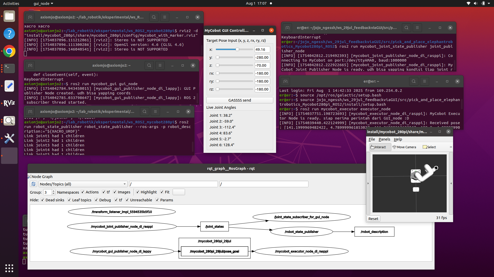

[LAST EDITED: 1 Aug 2025 17:02]

# 📌 What to Code First (MVP Plan)

## ✅ Step 1: Set Up Basic Robot Communication

- Install ROS2 Galactic and test MyCobot’s movement.

- Write a simple ROS2 node to send movement commands.

- Verify LAN communication with the MyCobot 280 Pi.
  

##  Step 2: Control the Vacuum Pump

Write a script to turn the vacuum pump on/off via ROS2.

Test picking up and releasing objects manually using commands.

## ✅ Step 3: Display Webcam Feed

- Use OpenCV to capture and display the video feed.
  
- Ensure real-time video streaming on your Qt5 GUI.
  

##  Step 4: Basic Object Detection

Detect a simple object using color or shape detection.

Overlay the detected object's position on the webcam feed.

##  Step 5: Move Robot to Object

Convert detected object position into robot coordinates.

- Move the MyCobot to the object using simple hardcoded movements.
  

##  Step 6: Automate Pick & Place

Combine movement + vacuum pump control to complete one full cycle:

Detect object.

Move arm to object.

Activate vacuum pump.

Lift & move object to a fixed drop zone.

Release object.

---
trus:
- gdocs & pdf buku TA,
- slides presentasi,
- poster,
- artikel ilmiah

(ini apalagi yg kurang? mumet gw baca panduan BAA)
---

# Implementasi_MyCobot280pi_ROS2
haha. TA. 💀  
semoga repo yg ini branchingnya lebih rapih ya.

yg lawas ada di repo lama.
()[https://github.com/axiomjo/TA_jojo] 

Project Milestones & Progress
## Important Deadlines:

* **PRASEM DAFTAR (P_DAFTAR):** 
#Tuesday, 9 Sep, 2025

* **PRASEM ACT (P_SIDANG):** 
#Monday, 15 Sep - Friday, 19 Sep, 2025 (Actual date will be updated :>)

* **DOSEN ESTETIK (D_ESTETIK):** 
#Thursday, 25 Sep, 2025

* **SEMINAR DAFTAR (S_DAFTAR):** 
#Tuesday, 7 Oct, 2025

* **SEMINAR AKTUAL (S_SIDANG):** 
#Monday, 13 Oct - Friday, 17 Oct, 2025

* **BUKU BAA (BUKU_BAA):** 
#Friday, 7 Nov, 2025

* **SYARAT YUDIS (SYAR_YUDI):** 
#Monday, 10 Nov, 2025

* **YUDISIUM (YUDISIUM):** November 12, 2025

This calendar highlights your key project milestones and deadlines for the coming months.

---

## August 2025

| Mon | Tue | Wed | Thu | Fri | Sat | Sun |
| :-- | :-- | :-- | :-- | :-- | :-- | :-- |
|     |     |     |     | 1   | 2   | 3   |
| 4   | 5   | 6   | 7   | 8 💀 pameran kampus  | 9   | 10  |
| 11  | 12  | 13  | 14  | 15 💀 workshop paper circuits | 16  | 17  |
| 18  | 19  | 20  | 21  | 22  | 23  | 24  |
| 25  | 26  | 27  | 28  | 29  | 30  | 31  |

---

## September 2025

| Mon | Tue | Wed | Thu | Fri | Sat | Sun |
| :-- | :-- | :-- | :-- | :-- | :-- | :-- |
| 1   | 2   | 3   | 4   | 5   | 6   | 7   |
| 8 💀   | **9 (💀 P_DAFTAR)** | 10  | 11  | 12  | 13  | 14  |
| **15 (P_AKTUAL)** | 16  | 17  | 18  | 19  | 20  | 21  |
| 22  | 23  | 24  | **25 (D_ESTETIK)** | 26  | 27  | 28  |
| 29  | 30  |     |     |     |     |     |

---

## October 2025

| Mon | Tue | Wed | Thu | Fri | Sat | Sun |
| :-- | :-- | :-- | :-- | :-- | :-- | :-- |
|     |     | 1   | 2   | 3   | 4   | 5   |
| 6 💀   | **7 (💀 S_DAFTAR)** | 8   | 9   | 10  | 11  | 12  |
| **13 (S_AKTUAL)** | 14  | 15  | 16  | 17  | 18  | 19  |
| 20  | 21  | 22  | 23  | 24  | 25  | 26  |
| 27  | 28  | 29  | 30  | 31  |     |     |

---

## November 2025

| Mon | Tue | Wed | Thu | Fri | Sat | Sun |
| :-- | :-- | :-- | :-- | :-- | :-- | :-- |
|     |     |     |     |     | 1   | 2   |
| 3   | 4   | 5   | 6   | **7 (BUKU_BAA)** | 8   | 9   |
| **10 (SYAR_YUDI)** | 11  | **12 (YUDISIUM)** | 13  | 14  | 15  | 16  |
| 17  | 18  | 19  | 20  | 21  | 22  | 23  |
| 24  | 25  | 26  | 27  | 28  | 29  | 30  |

---
---

## Weekly Logs (July - November 2025)

| Deadline Countdown | Date Range          | Observation                                | Notes                                                                   |
| :----------------- | :------------------ | :----------------------------------------- | :---------------------------------------------------------------------- |
| **P_DAFTAR: -50** | July 21 - July 27   | lost bgt, asli | 💀 |
| **P_DAFTAR: -43** | July 28 - Aug 03    | I FINALLY UNDERSTOOD THIS ROBOT"S COORDINATE SYSTEM aaa. fokus ke ngembangin paths to do stuff? | to-do: benerin node yg ngepublish joint state, vacuum pump (mvp 2), translate object positions into get_coordinates(mvp4), n bab 1 buku TA |
| **P_DAFTAR: -36** | Aug 04 - Aug 10     | 💀 | 💀|
| **P_DAFTAR: -29** | Aug 11 - Aug 17     | 💀 | 💀 |
| **P_DAFTAR: -22** | Aug 18 - Aug 24     | 💀 | 💀|
| **P_DAFTAR: -15** | Aug 25 - Aug 31     | 💀 | 💀 |
| **P_DAFTAR: -8** | Sep 01 - Sep 07     |      💀                                      |                    💀                                                     |

