[LAST EDITED: 13 OKT 2025 04:00]


repository konten TA untuk sistem ini, tersedia di
https://github.com/axiomjo/konten_TA  
apabila sidang sudah selesai.

# === SYSTEM OVERVIEW ===
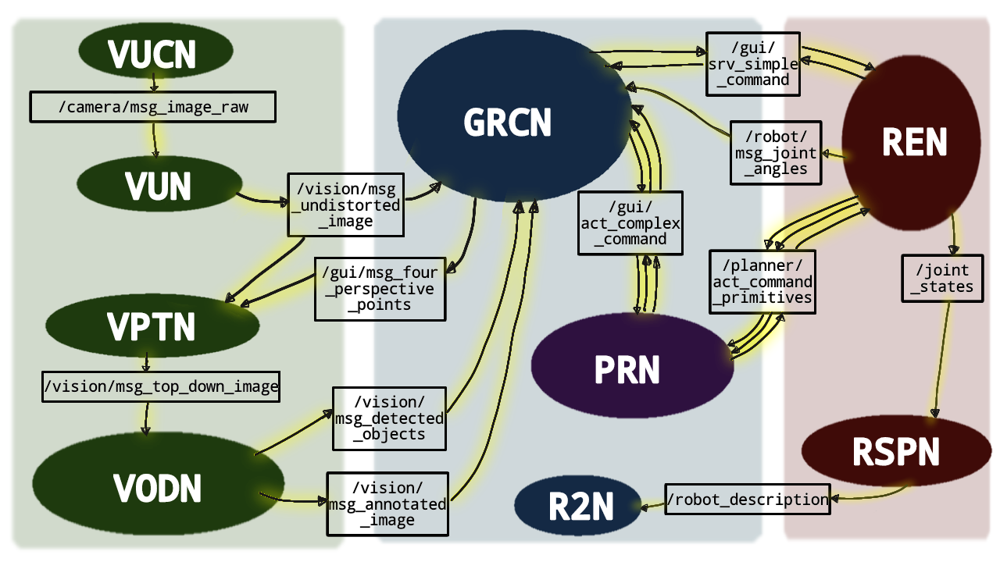

Sistem robot + antarmuka visual untuk mempermudah pengoperasian Mycobot 280 pi, dalam menjalankan tugas vacuum-and-place.
Dilengkapi computer vision sederhana, sehingga bisa metain konteks objek di lingkungannya ada di mana.


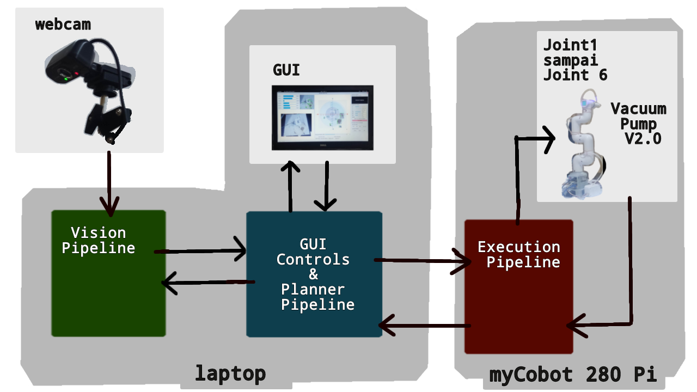

# === HOW TO RUN THIS SYSTEM ===
LANGKAH 1:  

Di terminal laptop,
setelah source ros2 galactic dan source install/setup.bash:

```
ros2 launch mycobot280pi_gui part1of2_Implementasi_Lengan_Robot280Pi_LAPTOP.launch.py
```

LANGKAH 2:  

Di terminal myCobot 280pi,
setelah source ros2 galactic dan source install/setup.bash:

```
ros2 launch mycobot280pi_robot part2of2_Implementasi_Lengan_Robot280Pi_MYCOBOT280PI.launch.py
```

--- 

dibuat untuk Tugas Akhir  
Josephine Dermawan   
Institut Sains dan Teknologi Terpadu Surabaya  
2025  

yg berjudul :  
"Implementasi Lengan Robot MyCobot 280 Pi untuk Memindahkan Koleksi Tanaman Kering di antara Lembaran Buku"


# === GUI evolution: ===  

on branch `begin_REFACTORING_GUI_forthethirdtime`

INI GUI UDH REFACTOR, UDAH OKLAH.
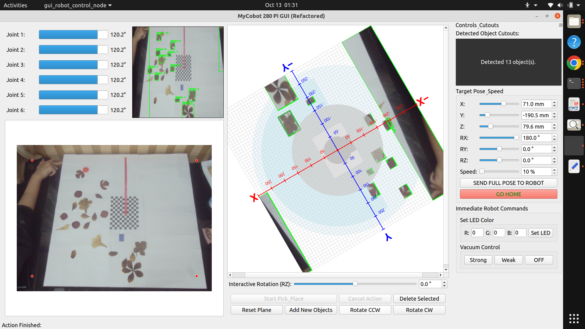


---
on branch `begin_IMPLEMENTING_GO_HOME`  

GUI aslinya ga intuitif pol LOL tp gpp mvpnya udah kok
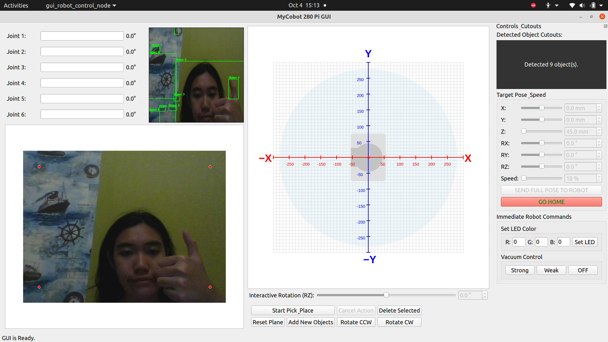


habis ini mau bikin branch baru buat ngebenerin arsitektur planner sama executor hahahaha.

---


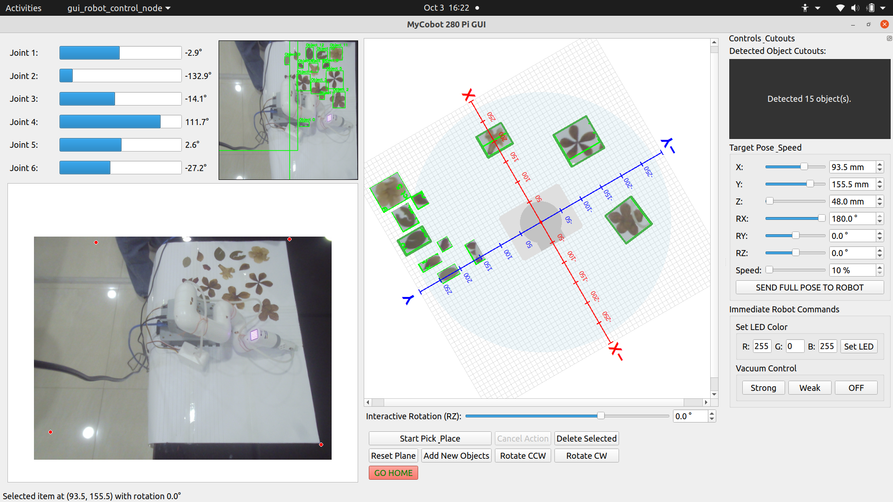

---
BRO WE DONE???  
on branch `ngurus_executor`  

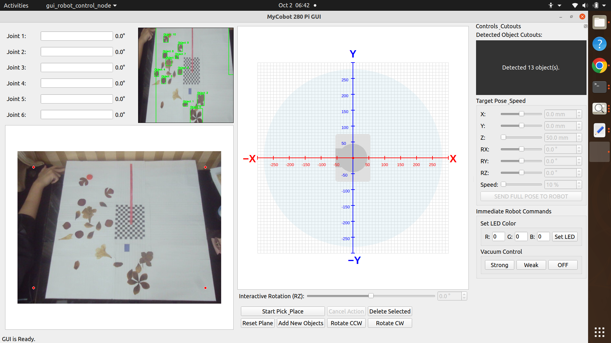

----
tambahin simplecommands, bukti action jalan
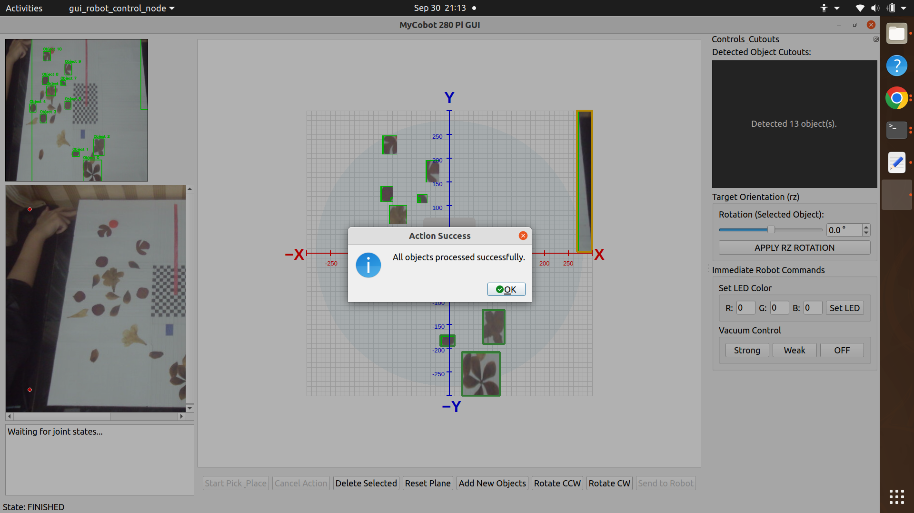

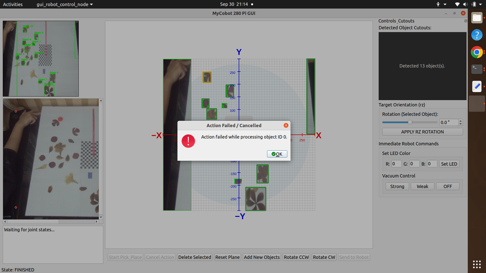

---
waras juga ini GUI
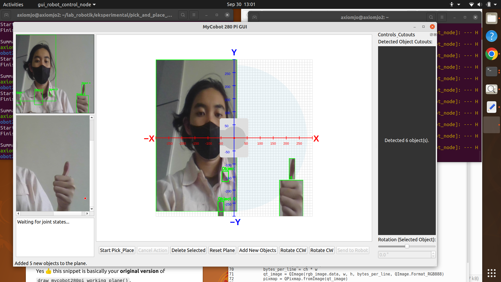

---

HAHAHA VISION PIPELINE KELAR  
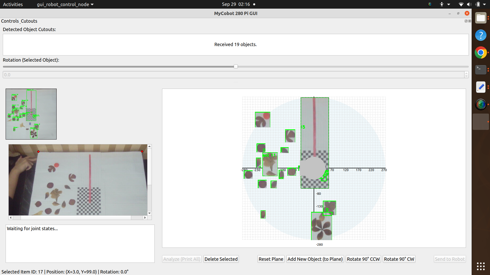

---
yeeyyy koordinatnya waras  
ini pake dummy image buat debug hahahaha  
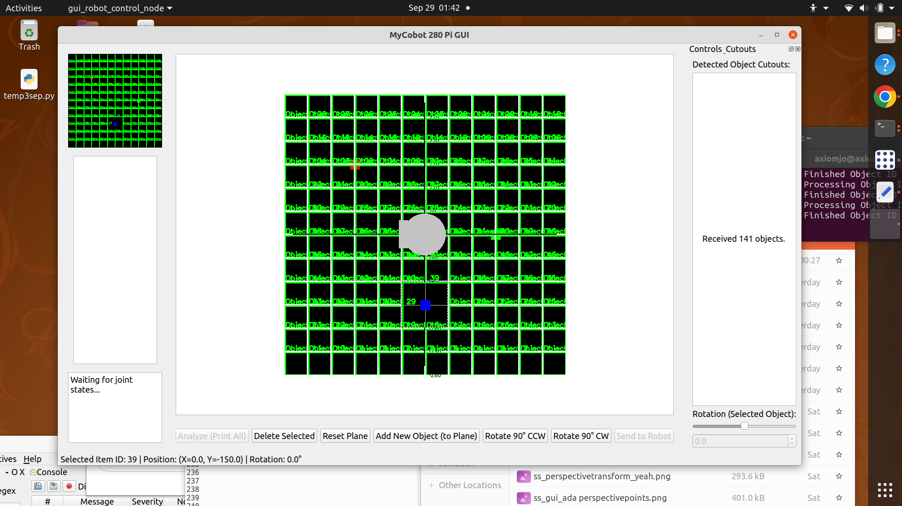

----
ok gui bisa pubulish four perspective points.  

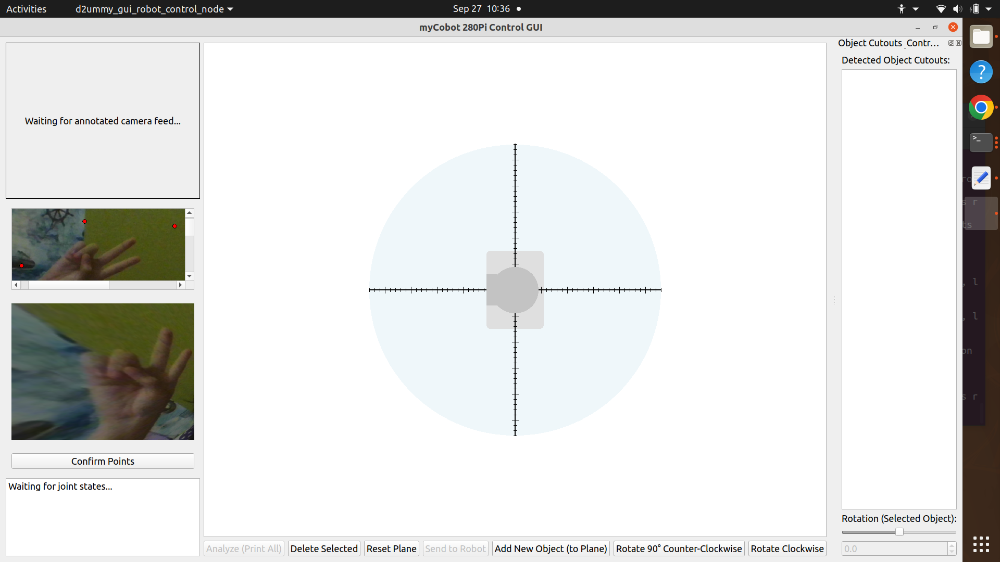

---
ok mulai ada vision ppeline di gui yh.  

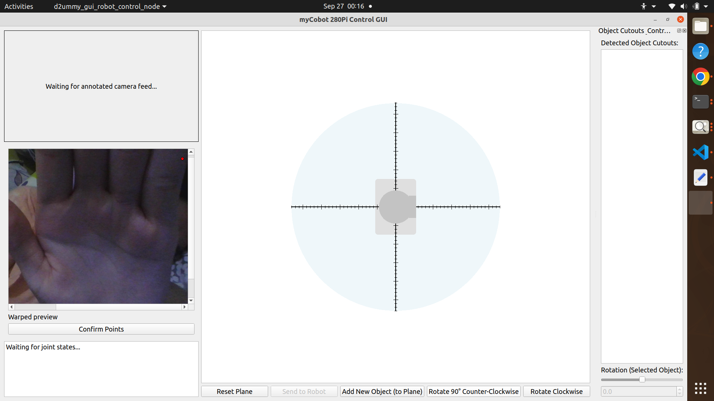

---
basically alu mundur ke gui 3 sept.


---
basically aku mundur ke branch MVP_3_4_5 krn guinya broken.


----
# Implementasi_MyCobot280pi_ROS2

branch `FINAL_VERSION`
this branch will be the one with clear patterns and naming conventions.    


# === Author's Note ===
Hi buat siapapun yg baca repo ini.  

tbh, aku ga berencana lanjutin proyek ini klo dah lulus.
tapi semoga repo ini bisa jadi pintu masuk buat anak2 elektro (atau infor) di ISTTS
yg mo nyentuh ROS2 .

Selama development, aku pake:  
- Linux Ubuntu 20.04 *  
- ROS2 Galactic Geochelone *  
- pymycobot 3.4.7 **  
- OpenCV (opencv-contrib-python 4.12.0.88)  

* Linux sana ROS2 nya kudu sepasang, krn tiap distro ROS2 punya distro linux yg direkomendasiin. why? i dunno, its what their devs said. 
* aku kekeuh pake ini krn tahun 2025, elephantrobotics blom ngeluarin image buat upgrade rasppi robotnya, jadi stuck sama ubuntu 20.04 :[ . kyknya mereka lebih pingin ngelanjutin mycobot yg jetson nano daripada pi. mboh ya.  
** pymycobot ada versi terbaru, tapi krn aku gaberani ngutak-ngatik sistem robotnya, aku putusin laptopnya ngikut robotnya.  
*** kampus punya lengan robot, ada 2. di jurusan teknik industri.  

thx for following my TA journey. semoga repo ini berfaedah.

